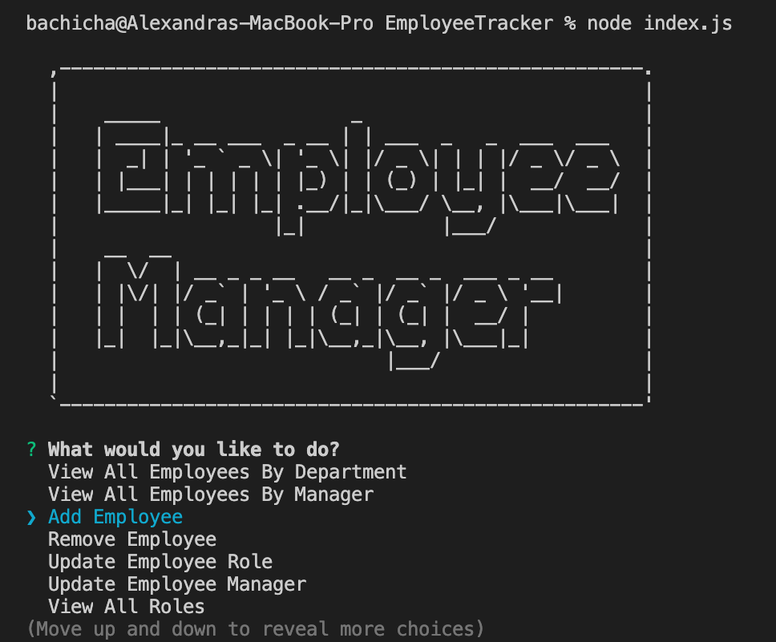

# Employee Tracker Application


## Description 

The Employee Tracker is a command-line application that allows for the management of a company's employees. It is designed with a Content Management System that makes it easier for non-developers to view and iteract with the information stored in the database. At minimum, it allows the user to add departments, roles and employees, view departments, roles and employees, and update employee roles. This application uses Node, Inquirer and MySQL.

## Table of Contents

- [User Story](#UserStory)
- [Installation](#Installation)
- [Instructions](#Instructions)
- [Features](#Features)
- [Demo](#Demo)
- [Licence](#Licence)
- [Repository](#Repository)

## User Story

```
As a business owner
I want to be able to view and manage the departments, roles, and employees in my company
So that I can organize and plan my business
```

## Installation 

To begin, initialize dependencies. Use the MySQL NPM package to connect to your MySQL database to perform queries then, use the Inquirer NPM package to interact with the user via the command line:

```
npm install mysql inquirer 
```

Use console.table to print MySQL rows to the console:

```
npm install console.table --save
```

## Instructions

The application is invoked with the following line of code:

```
node app.js
```

## Features

- View All Employees
- View All Employees by Department
- View All Employees by Manager
- Add Employee
- Remove Employee
- Update Employee Role
- Update Employee Manager
- View All Roles
- Add Role
- Remove Role
- View All Departments
- Add Department
- Remove Department 
- Quit (the application)

## Demo




## License 


## Repository

- [GitHub Profile](https://github.com/alexbachicha)

[](https://github.com/alexbachicha)


